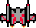

# Javasapiens - Space Fight

## Index
1. [Description of the project](#description-of-the-project)
2. [How to play](#how-to-play)
3. [Requirements](#requirements)

## Description of the project
Welcome to Space Fight, a game where a spacecraft is sent to save Earth from asteroids heading its way. Embark on a dangerous and thrilling mission that will test your skills.

  

 

  

## How to play
### Spacecraft movement:
- `↑`: moves the spacecraft up
- `↓`: moves the spacecraft down
- `→`: moves the spacecraft right
- `←`: moves the spacecraft left
- `Z`: shoots a projectile

### Asteroids:
The asteroids descend at different speeds, so be careful because if they collide with you, you will be destroyed!

### How to win:
After destroying all waves of asteroids, you will win the game.

## Requirements
- Java version: 21+
- SDK: 22+
