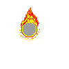
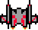

# Javasapiens - Space Fight

## Index
1. [Description of the project](#description-of-the-project)
2. [How to play](#how-to-play)
3. [Requirements](#requirements)

## Description of the project
Welcome to Space Fight, a game where a spacecraft is sent to save Earth from asteroids heading its way. Embark on a dangerous and thrilling mission that will test your skills.

  

 

  

## How to play
### Game controls:
- `↑`: moves the spacecraft up
- `↓`: moves the spacecraft down
- `→`: moves the spacecraft right
- `←`: moves the spacecraft left
- `Z`: shoots a projectile
- `R`: reset the game
- `ESC`: pause the game

### Asteroids:
The asteroids descend at different speeds, so be careful because if they collide with you, you will be destroyed!

### Rounds:
The game contains 5 rounds that increase in difficulty as the number of asteroids becomes increasingly larger.

### Score:
Each time an asteroid is destroyed by the player, the score increases by 50 points and can be viewed at the top of the screen or when the player loses to be able to view his progress. The maximum possible score in the game is 7500.

### How to win:
After destroying all waves of asteroids, you will win the game.

## Requirements
- Java version: 21+
- SDK: 22+
